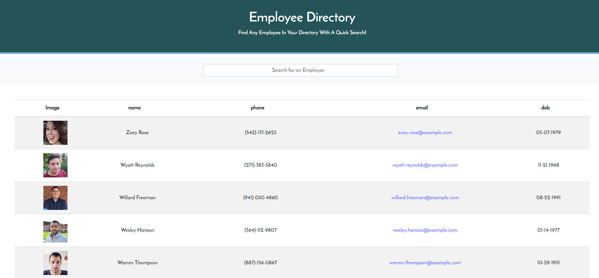

# Employee Directory Search

## Table of Contents
1. [ Description ](#desc)
2. [ Features ](#features)
3. [ Usage ](#usage)
4. [ Questions ](#quest)
    

## 1. Description
This application will provide a list of random Employees and provide the option to search for a person using the search bar. You are also able to sort in acending and descending order by clicking on the title of each column on the table. 

## Features

* Random User Generator - https://randomuser.me/
* React

    

## 3. Usage
Search using the search bar and typing in the Name of the employee you are looking for. All employees that have the the searched string within their name will show while all others will be removed.

Use the title bar and select a column to sort by that column.

 
<h3>Employee Directory Search</h3>

 

## 4. Questions
Please visit my GitHub to view all of my work:
https://www.github.com/bbrintle 

Check out the site:
https://blakes-employee-directory.herokuapp.com/

Contact me at: bbrintle@gmail.com